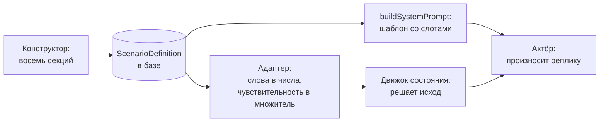

# Конфигурируемость

Сценарий это запись в базе, а не константа в коде. Его целиком собирает администратор через [конструктор](../admin/constructor.md), и каждая настройка действительно меняет поведение собеседника в разговоре.

Шесть исходных сценариев загружены сидами через ту же модель. Их можно открыть в админке, поправить и опубликовать заново.

## Как настройка доходит до разговора

Ключевое разделение проходит по адаптеру. Администратор задаёт уровни и ступени словами, а числа из них делает один модуль, `lib/scenarios/adapters.ts`. Движок при этом остался нетронутым: он по-прежнему принимает те же типы, что и раньше, когда контент лежал в файлах.

## Что настраивается

### Сфера и ситуация

| Настройка | Что меняет |
| --- | --- |
| Сфера | Раздел в каталоге, попадает в промт первой строкой контекста |
| Тема переговоров | Группу в каталоге и строку темы в промте |
| Роль игрока и роль ИИ | Кем стороны выступают в разговоре. Подписывают выбор начинающего и уходят в промт |
| Контекст | Два или три пункта в промте: что за проект, что случилось, почему сейчас |
| Кто начинает | При начале со стороны ИИ разговор открывается его репликой. При начале со стороны игрока собеседник вводит контекст в первом ответе |

Смена сферы не требует ничего, кроме текста. Тот же движок обслуживает и управление командой, и продажи, потому что ни одна его строка не знает про сотрудника и руководителя.

### Собеседник

| Настройка | Что меняет |
| --- | --- |
| Тон | Подставляет темперамент, триггеры, располагающие факторы, шкалу сопротивления, правила поведения, стартовые метрики, матрицу реакций и заготовленные реплики |
| Темперамент | Первую строку системного промта, то есть манеру речи |
| Триггеры и располагающие факторы | Блоки «тебя задевает» и «тебя располагает» в промте |
| Цель собеседника | Чего он добивается в разговоре |
| Первая реплика | Ориентир по смыслу, из которого модель делает живую реплику |
| Реплика на выходе | Как собеседник заканчивает разговор при срыве |

Вариант «свой» очищает всё перечисленное, и характер описывается с нуля.

### Сложность

| Настройка | Что меняет |
| --- | --- |
| Пресет | Лимит реплик, чувствительность и стартовые метрики разом |
| Стартовые метрики | Точку, с которой начинается разговор. Уровнями или точным числом |
| Лимит реплик | Сколько ходов до исчерпания времени |
| Чувствительность | Множитель всех дельт матрицы реакций |
| Цена раскрытия слоя | Сколько конструктивных действий подряд нужно на один слой |

Чувствительность это самый быстрый способ сделать разговор отзывчивее или глуше целиком, не трогая девятнадцать строк матрицы.

### Реакции

Таблица из девятнадцати действий и шести метрик, в ячейке одна из семи ступеней влияния. Это основной регулятор поведения: именно отсюда движок берёт, насколько каждое действие игрока двигает каждую метрику.

Перевод ступеней в числа собран в одном месте.

| Ступень | Значение |
| --- | --- |
| сильно вниз | −25 |
| вниз | −15 |
| слегка вниз | −8 |
| без изменений | 0 |
| слегка вверх | +8 |
| вверх | +15 |
| сильно вверх | +25 |

Дальше значение умножается на чувствительность и округляется. Ненулевое влияние не схлопывается в ноль даже на самой низкой чувствительности, иначе действие, помеченное значимым, переставало бы работать.

Уровни метрик переводятся так же: низкое даёт 15, среднее 50, высокое 85. Точное число, если оно указано, перекрывает уровень.

### Скрытые интересы

От двух до пяти слоёв. Пороги доверия назначаются по порядковому номеру из ряда 40, 55, 70, 85, 92. Метрика интересов растёт на сто, делённое на число слоёв, поэтому сценарий из двух слоёв выдаёт по половине за раз, а из пяти по двадцать процентов.

## Системный промт

Собирается чистой функцией `buildSystemPrompt` из шаблона `prompts/scenario-system-prompt.md`. Шаблон правится без касания кода, слоты подставляются по именам.

Порядок блоков задан спецификацией: роль и контекст, характер, цель, скрытые интересы по слоям, метрики и стартовое состояние, правила поведения, шкала сопротивления, реакции на действия игрока, ресурсы и ограничения, формат ответа.

Промт можно перехватить целиком. Кнопка ручной правки переводит сценарий в режим, где поля конструктора на промт больше не влияют, о чём администратор предупреждён. Возврат кнопкой «Собрать заново».

Функция детерминирована, это проверено тестом: один и тот же сценарий всегда даёт один и тот же текст.

## Что проверить за минуту

Критерий из требований звучит так: изменение тона, сложности или слоёв должно быть видно в разговоре. Проверяется последовательностью из четырёх шагов.

1. Откройте сценарий в конструкторе и поменяйте чувствительность с единицы на 0.75.
2. Нажмите «Тест-прогон».
3. Напишите реплику с признанием эмоции.
4. Посмотрите дельту в панели отладки.

Вместо минус пятнадцати будет минус одиннадцать. То же самое с тоном: одна и та же реплика на тревожном и на агрессивном собеседнике даёт разные числа, потому что матрицы у них разные.

## Что осталось за скобками

Генерация полной матрицы реакций моделью. Её пишет пресет, а не языковая модель, ради воспроизводимости исхода.

Метрики и пороги целей игрока. Администратор задаёт цели словами, а чем их мерить, решает система по фиксированной рубрике.
