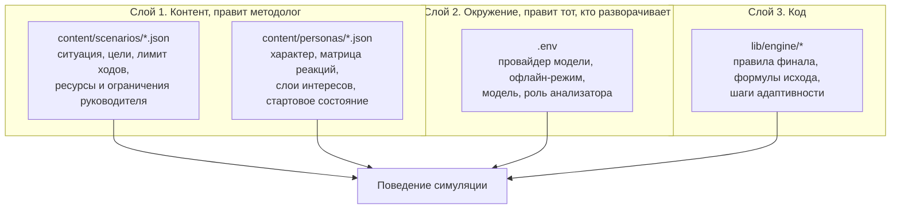

# Конфигурируемость

Страница отвечает на два вопроса: что в симуляции настраивается без правки кода и что из этого пока нельзя настроить из интерфейса.

Начнём с прямого ответа, чтобы не создавать ложного впечатления. **Контура администратора в прототипе нет.** Ни одного экрана, ни одного роута. Настраивается симуляция правкой JSON-файлов в `content/` и переменных окружения. Ниже разобрано, какой параметр за что отвечает и какой код его читает.

## Три слоя настройки

Смысл разделения в том, что психологическая модель лежит в слое 1. Чтобы изменить реакцию тревожного сотрудника на давление, разработчик не нужен: нужно поменять число в его JSON. Сборка и деплой при этом не требуются, потому что `lib/content/loader.ts` читает файлы с диска на каждый запрос.

## Что настраивается и что это меняет

### Сфера и ситуация

| Параметр | Где | Читается кодом | Что меняется |
| --- | --- | --- | --- |
| `title` | сценарий | да | Заголовок на доске разговоров и в разборе |
| `context` | сценарий | да | Описание ситуации на брифинге |
| `initiator` | сценарий | да | Кто говорит первым. При значении `employee` сотрудник открывает разговор своей репликой, при `manager` первый ход за руководителем |
| `playerRole`, `playerRoleDescription` | сценарий | да | Роль и полномочия игрока на брифинге |
| `successCriterion` | сценарий | да | Формулировка победы на брифинге |
| `config.domain` | сценарий | **нет** | Сфера деятельности. Поле заполнено значением «IT / разработка», но ни одна строка кода его не читает |

Сфера сейчас задаётся не полем, а текстами: должность сотрудника, его предыстория, контекст сценария и список полномочий руководителя. Чтобы перенести тренажёр из разработки в продажи, нужно переписать эти тексты в JSON, движок при этом не меняется.

### Сложность

| Параметр | Где | Читается кодом | Что меняется |
| --- | --- | --- | --- |
| `turnLimit` | сценарий | да | Сколько ходов до исчерпания времени. Сейчас 14 в обоих сценариях. Меньше ходов значит меньше запаса на ошибку |
| `playerGoals[].threshold` | сценарий | да | Порог метрики, при котором цель считается выполненной. Влияет и на показатель «цель достигнута» |
| `initialState` | персонаж | да | Стартовые метрики. Агрессивный в первом сценарии начинает с `R: 85, T: 15`, то есть сразу почти со стены, а рациональный стартует мягче |
| `hiddenInterests[].trustThreshold` | персонаж | да | Сколько доверия нужно, чтобы раскрылся слой. У агрессивного это 40, 55 и 70 |
| Число слоёв в `hiddenInterests` | персонаж | да | И глубину разговора, и шаг роста метрики интересов: она прибавляется как 100, делённое на число слоёв |
| Числа в `reactions` | персонаж | да | Цену каждого действия. Это основной регулятор сложности |
| `config.difficulty` | сценарий | **нет** | Уровень сложности числом. Стоит 3 у первого сценария и 4 у второго, кодом не читается |

Сложность сейчас регулируется не одним числом, а тремя настоящими рычагами: стартовым состоянием, порогами доверия и величинами в матрице реакций. Это точнее, чем ползунок, но требует правки JSON, а не переключателя.

### Тон собеседника

| Параметр | Где | Читается кодом | Что меняется |
| --- | --- | --- | --- |
| `temperament` | персонаж | да | Попадает в системный промпт первой строкой и задаёт манеру речи |
| `backstory`, `goal` | персонаж | да | Предыстория и собственная цель сотрудника в промпте |
| `behaviorRules` | персонаж | да | Список правил поведения в промпте, например «намекай вместо прямой просьбы» |
| `linesByResistance` | персонаж | да | Ориентир по тону в промпте, а в офлайн-режиме прямо реплики собеседника. По шесть на каждый уровень сопротивления |
| `exitLine` | персонаж | да | Как сотрудник выходит из разговора при срыве |
| `openingLine` | персонаж | да | С чего он начинает, если инициатор сотрудник |
| `voice` | персонаж | **нет** | Заполнено под синтез речи, которого пока нет |
| `config.tone` | сценарий | **нет** | Значение `neutral` у обоих сценариев, кодом не читается |

Тон настраивается через текст персонажа, и этот текст попадает в промпт целиком. Собрать промпт можно посмотреть в `buildActorSystemPrompt` в `lib/llm/actor.ts`: он склеивается из темперамента, предыстории, цели, правил поведения, полномочий руководителя, текущего состояния метрик в словесной форме и последних восьми реплик разговора.

### Роль и цели руководителя

| Параметр | Где | Читается кодом | Что меняется |
| --- | --- | --- | --- |
| `playerGoals` | сценарий | да | Цели на панели во время звонка. Каждая цель это метрика, порог и направление. Прогресс считается по текущему состоянию |
| `managerResources` | сценарий | да | Что руководитель может предложить. Уходит в промпт с указанием не отвергать эти варианты как невозможные |
| `managerConstraints` | сценарий | да | Чего руководитель не может. Уходит в промпт с указанием этого не требовать |

Списки полномочий решают конкретную проблему: без них модель выдумывает требования, которые руководитель физически не может выполнить, и разговор превращается в тупик не по вине игрока.

### Поведение движка и провайдера

| Переменная | Что меняет |
| --- | --- |
| `LLM_PROVIDER` | Принудительно выбирает провайдера: `yandex`, `openrouter`, `mock` |
| `MOCK_MODE` | Значение `true` включает полностью офлайн-режим без обращений к сети |
| `YANDEX_MODEL`, `YANDEX_API_MODE` | Модель и формат запроса к Yandex Cloud |
| `ANALYZER_LLM` | Отдать классификацию реплик модели вместо бесплатной эвристики |
| `JUDGE_STEP`, `JUDGE_MAX_DELTA_PER_TURN`, `JUDGE_TURN_LIMIT` и остальные `JUDGE_*` | Настройки экспериментального режима оценки |

Полный список с пояснениями на странице [Переменные окружения](../run/environment.md).

## Чего нет

**Экранов администратора.** Создать сценарий, персонажа или уровень через интерфейс нельзя. Таблица `CustomScenario` в схеме БД и переменная `ADMIN_PASSWORD` в `.env.example` объявлены заранее, но обращений к ним в коде нет.

**Чтения `config`.** Поле `config` с полями `domain`, `difficulty` и `tone` присутствует в обоих файлах сценариев и объявлено в типе `Scenario` в `lib/engine/types.ts`. Ни один модуль его не читает. Проверяется поиском по репозиторию.

**Генерации сценария по параметрам.** Собрать новый уровень из набора настроек, например «продажи, сложность 4, агрессивный собеседник», продукт не умеет. Уровни собираются только из готовых файлов контента.

## Что нужно, чтобы эти настройки заработали

Оценка по существующему коду, чтобы был виден объём, а не обещание.

1. **Прокинуть `config` в промпт актёра.** `config.domain` и `config.tone` добавляются в системный промпт в `buildActorSystemPrompt`. Это правка одного файла.
2. **Связать `config.difficulty` с движком.** Множитель на дельты матрицы реакций либо смещение порогов доверия в `applyTurn`. Здесь нужна аккуратность: правка меняет цифры на всех уровнях, поэтому тесты из `tests/engine.test.ts` придётся пересчитать.
3. **Экран администратора.** Список сценариев и персонажей из `content/`, форма редактирования полей, запись результата в `CustomScenario` и чтение оттуда в `lib/content/loader.ts` наравне с файлами. Доступ по `ADMIN_PASSWORD`, который уже объявлен.
4. **Генерация персонажа по параметрам.** Промпт, который по сфере, теме, сложности и типу личности собирает JSON персонажа с матрицей реакций, плюс валидация результата схемой Zod перед записью. Матрицу нельзя отдавать модели без проверки: именно она отвечает за воспроизводимость исхода.

Порядок здесь не случайный. Первые два пункта дают настоящую конфигурируемость на существующем контенте, а третий и четвёртый добавляют к ней интерфейс.
