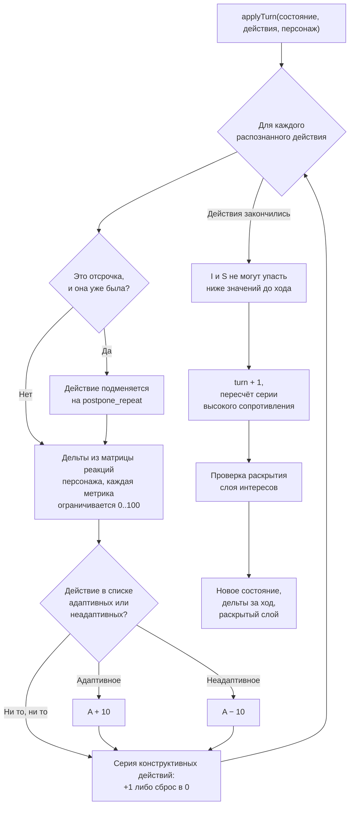
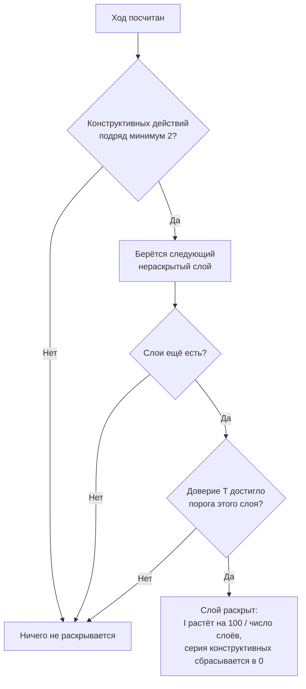
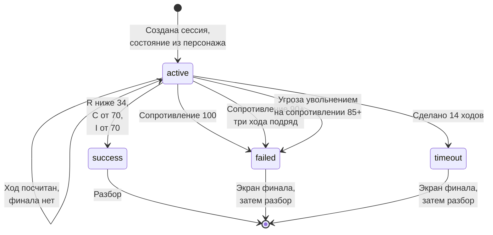

# Движок состояния

Единственное место, где решается исход разговора. Файл `lib/engine/state.ts`, около 130 строк, ни одного обращения к сети или к базе.

## Состояние

```ts
interface SessionState {
  R: number; // сопротивление
  T: number; // доверие
  I: number; // интересы
  S: number; // решения
  C: number; // договорённости
  A: number; // адаптивность
  turn: number;                  // номер текущего хода
  revealedLayers: number[];      // раскрытые слои скрытых интересов
  constructiveStreak: number;    // сколько конструктивных действий подряд
  highResistanceStreak: number;  // сколько ходов сопротивление держится на 90+
  postponeCount: number;         // сколько раз разговор был отложен
}
```

Шесть метрик от 0 до 100. Четыре служебных счётчика существуют потому, что часть правил зависит не от текущего значения, а от истории: слой интересов раскрывается только после серии конструктивных ходов, а разговор срывается только после трёх ходов подряд на максимальном сопротивлении.

Стартовые значения у каждого персонажа свои и берутся из `initialState` в его JSON. Агрессивный сотрудник в первом сценарии начинает с `R: 85, T: 15`, то есть разговор стартует почти со стены. Унифицированного старта 50 на 50 для всех типов нет намеренно, это требование психологической методологии.

## Расчёт хода



Четыре правила в этом расчёте стоит объяснить отдельно.

**Матрица реакций принадлежит персонажу, а не действию.** У каждого из шести персонажей свой словарь `reactions` на 19 действий. Признание конкретного вклада у тревожного сотрудника снимает больше сопротивления, чем у агрессивного, потому что так написано в его JSON, а не потому, что движок знает что-то про признание.

**Повторная отсрочка распознаётся движком, а не анализатором.** Если руководитель второй раз говорит «я подумаю», движок сам подменяет действие на `postpone_repeat`, независимо от того, заметил анализатор повтор или нет. Это защита воспроизводимости: исход не должен зависеть от того, насколько внимательным оказался классификатор. Счётчик отсрочек обнуляется, когда появляется зафиксированная договорённость.

**Адаптивность считается попаданием в характер.** У персонажа есть списки `adaptiveActions` и `maladaptiveActions`. Попадание в первый даёт +10 к A, во второй −10. Ровно поэтому одна и та же тактика на разных типах личности даёт разную адаптивность.

**Интересы и решения не откатываются.** Строки `next.I = Math.max(next.I, before.I)` и то же для S. Один раз выясненная причина не может стать невыясненной от того, что следующая реплика была грубой. Договорённости, наоборот, откатываются, и единственный путь к этому это повторная отсрочка.

## Раскрытие скрытых интересов

Это главная механика продукта. У сотрудника есть от трёх до четырёх слоёв причин, о которых он не скажет сразу, и каждый следующий слой требует больше доверия.



Пороги доверия заданы в самом слое, поле `trustThreshold`. У агрессивного сотрудника из первого сценария это 40, 55 и 70. Если в JSON порог не указан, движок берёт значение по умолчанию из ряда 40, 55, 70, 85.

Два следствия этой конструкции. Слои раскрываются строго по порядку, перескочить через первый нельзя. И после каждого раскрытия серия конструктивных действий сбрасывается, поэтому нельзя набрать доверие один раз и получить все слои подряд.

## Условия финала

```ts
export function checkEnding(state: SessionState, scenario: Scenario): Ending {
  if (state.R < 34 && state.C >= 70 && state.I >= 70) return "success";
  if (state.brokenOff) return "failed";
  if (state.R >= 100) return "failed";
  if (state.highResistanceStreak >= 3) return "failed";
  if (state.turn >= scenario.turnLimit) return "timeout";
  return null;
}
```



Победа требует всех трёх условий одновременно. Снятого сопротивления недостаточно, зафиксированных договорённостей недостаточно, нужно ещё дойти до настоящей причины.

### Сопротивление на максимуме

Сопротивление 100 заканчивает разговор сразу, не дожидаясь трёх ходов подряд. Собеседник произносит прощальную реплику, положенную ему по полю `exitLine`, и кладёт трубку. Игрок видит экран проигрыша, а из него переходит в разбор.

Проверка стоит до серии из трёх ходов и потому срабатывает раньше неё. Это важно для разговоров, которые стартуют с высоким сопротивлением: там до сотни можно дойти за один резкий ход, и заставлять игрока давить ещё два хода незачем.

### Обрыв разговора

Угроза увольнением по методичке психолога может оборвать разговор, не дожидаясь трёх ходов на максимальном сопротивлении. В движке это отдельный флаг: `applyTurn` ставит `brokenOff`, если распознано действие `threat_of_firing` и сопротивление после хода дошло до 85.

Порог важен. На спокойном разговоре угроза остаётся просто очень дорогим ходом: сопротивление подскакивает, доверие падает, но человек остаётся за столом. На уже высоком сопротивлении она заканчивает разговор сразу.

## Скрытый провал

```ts
export function isHiddenFailure(state: SessionState): boolean {
  return state.C >= 70 && state.T < 40;
}
```

Договорённости зафиксированы, доверия нет. Внешне это выглядит как успешный разговор, а на деле сотрудник согласился, чтобы разговор закончился. Разбор в таком случае выдаёт прямую формулировку вместо поздравления: интересы не выяснены и доверия нет, человек согласился формально.

Правило считается от состояния и работает одинаково на всех шести уровнях. В контенте у персонажей есть ещё флаг `hiddenFailure`, и у `s3-anxious` он выставлен в `true`, но кодом этот флаг пока не читается, поэтому на поведение он не влияет.

## Подсчёт исхода

Четыре показателя разбора считаются из финального состояния, `lib/engine/scoring.ts`:

| Показатель | Формула |
| --- | --- |
| Цель достигнута | доля выполненных целей сценария, в процентах |
| Удовлетворённость сотрудника | `(100 − R) × 0,4 + T × 0,3 + I × 0,3` |
| Готовность выполнять договорённости | `C × 0,5 + T × 0,3 + S × 0,2` |
| Риск конфликта или ухода | `R × 0,5 + (100 − T) × 0,3 + (100 − C) × 0,2` |

Цели задаются в сценарии и проверяются по метрике с порогом. У цели бывает направление: «не потерять сотрудника» это `R` ниже 34, поэтому для неё сравнение перевёрнуто.

Звёзды за уровень: одна за победу, вторая за все выполненные цели сценария, третья дополнительно требует раскрытых слоёв интересов и доверия от 70.

## Что гарантируют тесты

`tests/engine.test.ts`, 19 проверок:

- **Детерминизм.** Один и тот же вход дважды даёт побайтово одинаковый выход, и одна и та же последовательность действий не может дать разное сопротивление.
- **Три асимметрии между типами личности.** Конкретное признание сильнее бьёт по тревожному, чем по агрессивному. Мягкость без конкретики нейтральна для тревожного, стоит адаптивности агрессивному и повышает сопротивление рациональному. Опора на объективные критерии сильнее всего помогает рациональному.
- **Необратимость прогресса.** I и S не падают даже после разрушительного хода.
- **Автоматическое распознавание повторной отсрочки**, в том числе когда анализатор пометил ход иначе, и сброс счётчика после фиксации договорённости.
- **Шлюз раскрытия слоя.** Слой не раскрывается без двух конструктивных действий подряд и достаточного доверия, и раскрывается, когда оба условия выполнены.
- **Все четыре исхода** `checkEnding`, включая отсутствие финала в середине разговора.
- **Обрыв разговора на угрозе увольнением**: на высоком сопротивлении разговор заканчивается сразу, на низком продолжается, но стоит дорого.
- **Повышение голоса** бьёт по тревожному сотруднику сильнее, чем по рациональному, и по сопротивлению, и по доверию.
- **Рациональный из сценария «падение результатов»**: стартует с высокой открытостью, раскрывает первый слой на опоре на критерии, теряет договорённости на «я подумаю» без срока.

Асимметрии между типами личности вынесены в тесты намеренно. Это продуктовое обещание, а не деталь реализации: если правка контента их сломает, тест упадёт.
