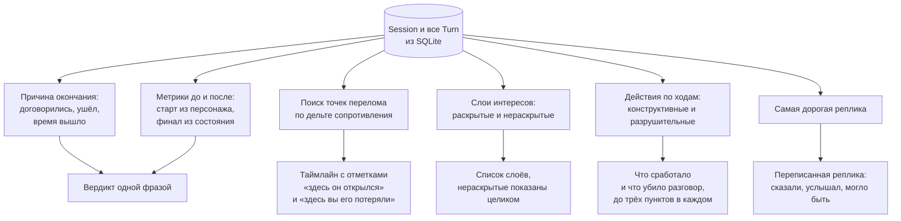

# Обратная связь по итогам

Обратная связь приходит в двух местах: во время разговора и после него. Во время разговора она минимальна, чтобы не подсказывать. После разговора подробна, потому что учит именно она.

## Во время разговора

На панели справа видны шесть метрик, изменение за последний ход и прогресс по целям сценария. Значения приходят событием `state` по SSE до того, как собеседник начнёт говорить.

Чего на панели нет намеренно: распознанных кодов действий и объяснения, почему метрика двинулась. Иначе игрок начинает оптимизировать классификатор, а не разговор. Полная расшифровка каждого хода открывается только в разборе.

## Что считает разбор

Разбор собирает `loadDebrief` в `lib/flow/debrief.ts`. Данные берутся из сохранённых ходов, никаких обращений к модели на этом шаге нет, поэтому разбор одного и того же разговора всегда одинаковый.

### Вердикт

Одна фраза, которая называет настоящий исход. Правила проверяются по порядку, и первое подошедшее выигрывает:

1. Договорённости от 70, доверие ниже 40. Формально договорились, но человек согласился, чтобы разговор закончился.
2. Сотрудник ушёл из разговора. Сопротивление не снято, до причины дойти не удалось.
3. Время вышло, договорённости ниже 50. Конкретики так и не появилось.
4. Договорённости от 70, доверие от 60, интересы от 60. Договорённости держатся на доверии.
5. Во всех остальных случаях исход половинчатый.

Первое правило стоит первым намеренно. Разговор с высокими договорённостями внешне выглядит успешным, и разбор обязан назвать это формальным согласием, а не победой.

### Точки перелома

По всем ходам ищется максимальное падение сопротивления и максимальный рост. Ход с самым сильным падением получает отметку «здесь он открылся», ход с самым сильным ростом «здесь вы его потеряли». Отметка появляется только при изменении от 10 пунктов, иначе шум в пару единиц выдавался бы за перелом.

### Что сработало и что убило

Все распознанные за разговор действия делятся на конструктивные и разрушительные по спискам из `lib/engine/types.ts`, дубликаты убираются, в каждой колонке остаётся до трёх пунктов. К пункту прикладывается цитата вашей реплики, в которой действие было распознано.

### Переписанная реплика

Берётся ход с наибольшим ростом сопротивления. Если рост меньше 10, блок не показывается вообще: выдумывать урок там, где ничего плохого не произошло, вреднее, чем промолчать.

Блок состоит из трёх частей: что вы сказали, дословно из лога; что он услышал; как можно было сказать то же самое. Вторая и третья части подобраны по коду действия, который дороже всего стоил. Например для обвинения это «меня назначили виноватым» и совет назвать факт без адресата вины.

### Слои интересов

Раскрытые слои показываются с номером хода, на котором это произошло. Нераскрытые показываются полным текстом с пометкой, что разговор до этого не дошёл. Это сделано специально: главный вывод обычно лежит там, куда игрок не добрался, и скрывать эту часть означало бы оставить урок недосказанным.

### Привязка к ответу игрока

Разбор заканчивается абзацем, привязанным к третьему вопросу входного опроса. Если игрок ответил, что договорённости у него не выполняются, абзац показывает его метрику договорённостей словами и объясняет, где в разговоре не появилось конкретики. Если ответил, что разговоры скатываются в конфликт, абзац отправляет к номеру хода, после которого выросло сопротивление.

### Проверка типа личности

Первым блоком разбора игрок отвечает, с кем он разговаривал: агрессивный, тревожный или рациональный. Тип на карточке разговора не написан, определить его по поведению это отдельная задача.

После ответа открывается результат: верно или нет, полное название типа, признаки, по которым его можно было узнать, и объяснение, почему это важно. У каждого типа своё средство снятия сопротивления, и без определения типа руководитель применяет не то средство.

Ответ сохраняется по идентификатору сессии в localStorage, поэтому перезагрузка страницы не даёт переугадать после того, как правильный ответ уже показан.

## Второй, более старый расчёт

В коде есть ещё один путь расчёта разбора: `GET` и `POST /api/session/:id/debrief`. Он считает звёзды за уровень, текстовые рекомендации по шести правилам из `lib/engine/recommendations.ts` и сохраняет результат в таблицу `Debrief`.

Этот путь остался от предыдущей версии экрана. Текущий экран разбора его не вызывает, а обращается к `loadDebrief` напрямую на сервере. Из интерфейса API дёргает только страница `/reflect/:sessionId`, на которую сейчас нет ни одной ссылки.

Дублирование названо здесь прямо, потому что иначе оно выглядит как расхождение документации с кодом. Логика рекомендаций работоспособна, но на экран не выведена.
