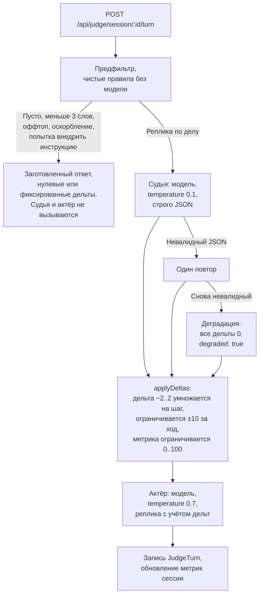

# LLM-судья, эксперимент

Второй способ оценивать ход, который лежит в репозитории рядом с основным. Здесь дельты метрик каждый ход назначает языковая модель по рубрике гарвардского метода, а не заранее просчитанная матрица реакций психолога.

Это исследовательская ветка, а не основной путь продукта. Своего интерфейса у неё нет, вызывается из тестов и напрямую по HTTP. Полное описание в файле `JUDGE_MODULE.md` в корне репозитория.

## Зачем он есть

У матрицы реакций есть цена: каждое действие на каждом персонаже нужно оценить вручную, и psycho-контент растёт линейно с числом уровней. Судья проверяет, можно ли заменить ручную матрицу рубрикой, оставив исход управляемым.

Изоляция сделана так, чтобы эксперимент не мог испортить основной движок. Отдельные таблицы `JudgeSession` и `JudgeTurn`, отдельные пути `/api/judge/*`, отдельный клиент модели. В `lib/engine/*` модуль не заходит и ничего там не меняет.

## Как проходит ход

Два предохранителя в этой схеме важнее остального.

**Предфильтр стоит до модели.** Пустая реплика, мусор, оскорбление и попытка подменить инструкции модели отбиваются правилами, и обращения к модели не происходит вовсе. Это экономит деньги и закрывает очевидный способ сломать оценку.

**Абсолютные числа считает не модель.** Судья возвращает дельту в диапазоне от −2 до 2, а `applyDeltas` превращает её в изменение метрики: умножение на шаг, жёсткий потолок ±10 за ход, ограничение метрики нулём и сотней. Модель не может выдать скачок на 60 пунктов, даже если захочет.

## Метрики

Те же шесть, что в основном движке, под другими именами. Маппинг в `lib/judge/types.ts`.

| В модуле | В основном движке |
| --- | --- |
| adaptation | A |
| trust | T |
| resistance, инвертирована: рост это хуже | R |
| interests | I |
| solutions | S |
| commitment | C |

Стартовые значения берутся из `persona.initialState` существующих файлов персонажей, а не выставляются всем одинаково. Разные типы личности стартуют с разного сопротивления и доверия, как в психологической методологии.

## Промпты в файлах, а не в коде

- `prompts/rubric.md`, определения метрик и техник.
- `prompts/judge.md`, шаблон промпта судьи.
- `prompts/actor_rational.md`, `actor_anxious.md`, `actor_aggressive.md`, по одному на тип личности. Контекст сценария подставляется переменной, а не вписан в текст.

## Настройки

| Переменная | По умолчанию | Смысл |
| --- | --- | --- |
| `JUDGE_LLM_CLIENT` | автоопределение | `mock` или `yandex`. Пусто означает yandex при наличии ключей, иначе mock |
| `JUDGE_STEP` | 5 | Множитель дельты судьи |
| `JUDGE_MAX_DELTA_PER_TURN` | 10 | Потолок изменения одной метрики за ход |
| `JUDGE_TURN_LIMIT` | 12 | Лимит ходов |
| `JUDGE_COMMITMENT_SUCCESS` | 80 | Порог commitment для успеха |
| `JUDGE_TRUST_FAIL` | 15 | Порог trust для провала |
| `JUDGE_LLM_TIMEOUT_MS` | 20000 | Таймаут обращения к модели |

Отдельных ключей модуль не требует: реальные вызовы используют те же `YANDEX_API_KEY` и `YANDEX_FOLDER_ID`.

## Проверка без сети

Три запроса создают сессию, делают ход и получают отчёт. Команды с примерами ответов в `JUDGE_MODULE.md`. На `MockClient` судья всегда возвращает один и тот же валидный ответ, а маркеры `__FORCE_INVALID_JSON__` и `__FORCE_ERROR__` в тексте реплики позволяют проверить повтор и деградацию без сети. Этим пользуются тесты.

`tests/judge.test.ts`, 21 проверка: предфильтр во всех четырёх случаях, ограничение дельт и метрик, включая случай, когда шаг больше потолка за ход, разбор ответа судьи, деградация на битом JSON и на обрыве транспорта, условия завершения уровня.

## Что в модуле не доделано

- В рубрике нет якорных примеров «реплика, балл». Судья работает по одним определениям метрик, пока психолог не впишет примеры. Места под них отмечены в `prompts/rubric.md`.
- Принудительная JSON-схема на стороне Yandex Cloud не проверена, поэтому ответ валидируется схемой Zod у нас. Повтор и деградация на этом и построены.
- Контента персонажей для сценария «Сложная задача» нет, и запрос с этим сценарием возвращает понятную ошибку вместо тихой поломки.
