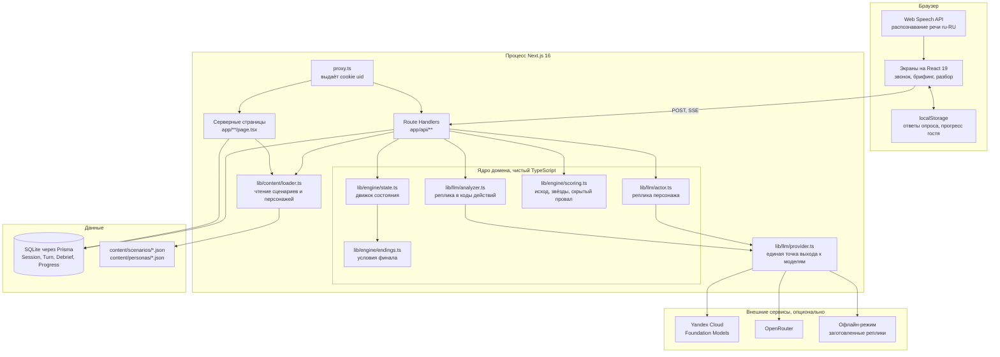
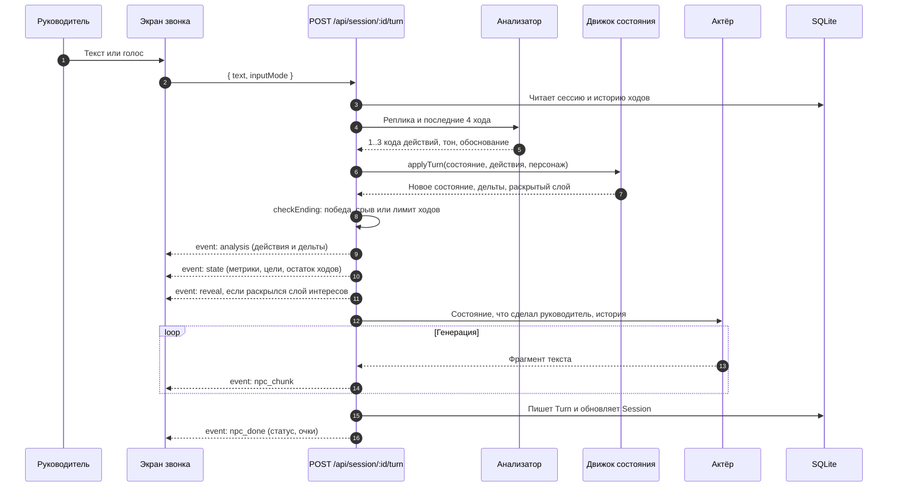

# Общая архитектура

Приложение целиком живёт в одном процессе Next.js 16. Отдельного бэкенда нет: серверная часть это Route Handlers в `app/api/*`, они выполняются в Node.js рядом со страницами. База данных это файл SQLite. Контент сценариев это JSON-файлы на диске.

Такой выбор сделан ради одного свойства: прототип поднимается четырьмя командами на любой машине с Node.js и не требует ни Docker, ни внешних сервисов. Разбор запуска на странице [Быстрый старт](../run/quickstart.md).

## Компоненты

## Границы ответственности

Три правила определяют, что где лежит.

**Исход разговора решает только движок.** `lib/engine/state.ts` это чистая функция без обращений к сети и без обращений к базе. На вход поступает текущее состояние, список распознанных действий и персонаж, на выход новое состояние. Больше нигде метрики не меняются.

**Модель ничего не решает.** У неё две роли, и обе подчинённые. Анализатор превращает свободный текст в коды из закрытого списка, а актёр произносит реплику в уже посчитанном состоянии. Если модель недоступна или ответила мусором, ход всё равно завершается, потому что у каждой роли есть детерминированная замена.

**Выход к моделям в одном файле.** `lib/llm/provider.ts` отдаёт интерфейс из двух методов, `complete` и `stream`. Реализаций четыре: Yandex Cloud нативный, Yandex Cloud OpenAI-совместимый, OpenRouter, офлайн-заглушка. Остальной код не знает, кто за интерфейсом.

## Как проходит один ход

Ход это один запрос `POST /api/session/:id/turn`, который отвечает потоком SSE. Клиент получает распознанные действия и новые метрики раньше, чем реплику собеседника, поэтому панель справа обновляется сразу, а текст доезжает по мере генерации.

Важен порядок двух вещей. Состояние считается и отправляется клиенту до того, как начинает говорить модель. Значит реплика собеседника не может разойтись с цифрами на панели, она генерируется уже внутри посчитанного состояния.

Запись в базу происходит после генерации, одной парой операций: создание `Turn` и обновление `Session`. Поэтому прерванный на середине ход не оставляет полузаписанного состояния.

## Хранение

| Таблица | Что хранит |
| --- | --- |
| `Session` | Сессия разговора: пользователь, сценарий, персонаж, текущее состояние в JSON, статус, ссылка на родительскую сессию и номер хода ветвления |
| `Turn` | Ход: текст руководителя, режим ввода, распознанные действия, дельты, состояние после хода, реплика персонажа, задержка |
| `Debrief` | Результат разбора: исход, звёзды, точки перелома, ответы на рефлексию, рекомендации |
| `Progress` | Прогресс по уровням: лучший результат, число попыток, открыт ли уровень |
| `CustomScenario` | Объявлена под сценарии администратора, кодом не используется |
| `JudgeSession`, `JudgeTurn` | Отдельные таблицы экспериментального режима оценки |

Состояние сессии лежит в `Session.state` целиком как JSON, а состояние после каждого хода дублируется в `Turn.stateAfter`. Дублирование намеренное: именно оно позволяет восстановить состояние на любом ходу и форкнуть разговор с этой точки, не пересчитывая всю историю заново.

Контент читается с диска на каждый запрос, без кеша в памяти, `lib/content/loader.ts`. На пяти файлах это незаметно, зато правка JSON видна после перезагрузки страницы, без перезапуска сервера.

## Идентификация пользователя

Полноценных аккаунтов в прототипе нет. `proxy.ts` на первом запросе ставит cookie `uid` со случайным UUID на год, и все сессии привязываются к ней. Экраны регистрации и входа собраны, но бэкенда за ними нет.

В Next.js 16 файл `middleware.ts` переименован в `proxy.ts`, а экспортируемая функция называется `proxy`. Это не самодельное решение, а требование текущей версии фреймворка.
