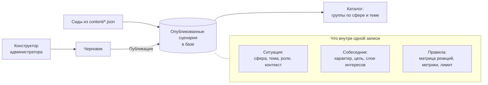
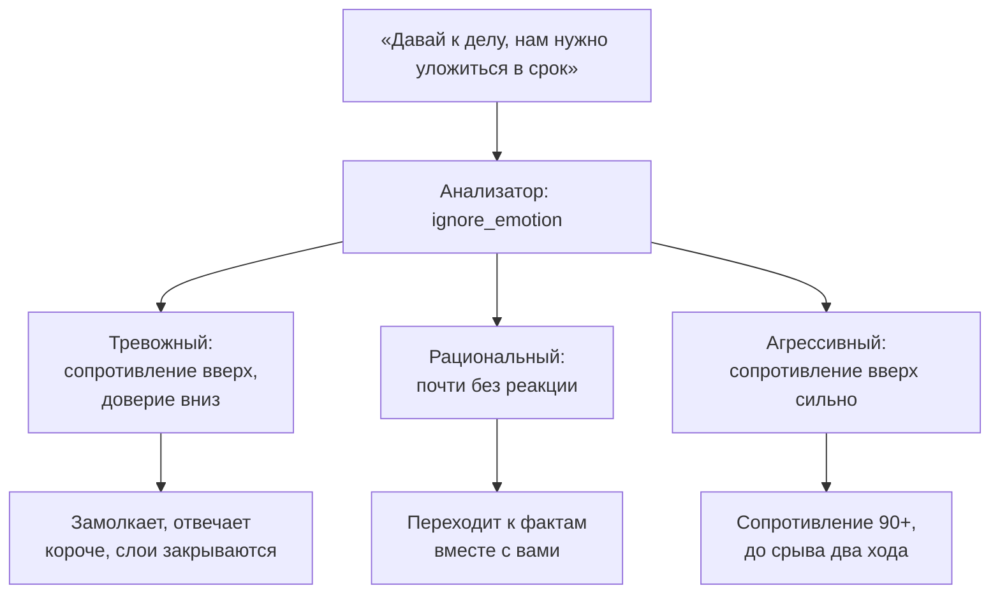
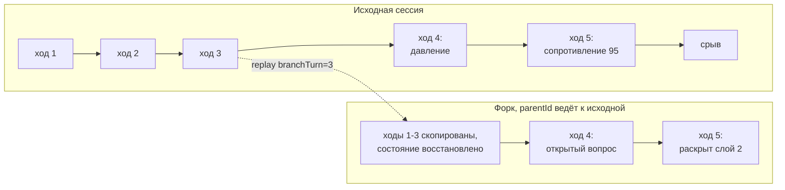

# Сценарии и ветвление

## На чём держится результат

Гибрид с жёстким разделением ролей. Правила решают, что произошло. Модель решает, какими словами это сказано.

| Что решается | Кто решает | Где это в коде |
| --- | --- | --- |
| Какие действия совершил игрок | Эвристика на ключевых словах, опционально модель | `lib/llm/analyzer.ts` |
| Как эти действия изменили состояние | Матрица реакций персонажа, чистый TypeScript | `lib/engine/state.ts` |
| Раскрылся ли скрытый интерес | Порог доверия и серия конструктивных ходов | `lib/engine/state.ts` |
| Закончился ли разговор и чем | Четыре правила финала | `lib/engine/endings.ts` |
| Какими словами сотрудник это произносит | Языковая модель, на входе уже посчитанное состояние | `lib/llm/actor.ts` |

Ни одно решение об исходе модели не передаётся. Если модель отвалилась, разговор продолжается на заготовленных репликах персонажа, и метрики при этом считаются точно так же. Проверить это можно, поставив `MOCK_MODE="true"`: продукт остаётся полностью играбельным без сети.

Чистой генерации сценария моделью в продукте нет, и это осознанный отказ. Ради воспроизводимости исхода и ради того, чтобы психолог мог править поведение персонажа, не трогая промпты.

## Из чего состоит уровень

Сценарий это одна запись в базе, в которой ситуация и собеседник лежат вместе. Шесть готовых загружены сидами, по три типа личности на каждую из двух тем. Новые создаёт администратор в [конструкторе](../admin/constructor.md).

Одна запись задаёт и ситуацию, и собеседника: сферу, тему, роли сторон, контекст, цели, лимит ходов, характер, слои скрытых интересов, матрицу реакций, а также что игрок может предложить и чего не может. Списки `managerResources` и `managerConstraints` попадают в промпт актёра, поэтому сотрудник не требует невозможного и не отвергает реальные предложения как невозможные.

Матрица реакций покрывает девятнадцать действий и шесть метрик. Списки адаптивных и неадаптивных действий приходят из пресета тона, заготовленные реплики офлайн-режима тоже.

Порядок внутри группы фиксирован педагогикой, а не алфавитом: рациональный, затем тревожный, затем агрессивный. Сначала освоить механику на том, кто говорит прямо, потом учиться слышать несказанное, потом держать позицию под давлением. Порядок задан в `lib/scenarios/runtime.ts`.

Полное описание полей на странице [Модель сценария](../reference/content.md).

## Где возникает ветвление

Ветвление здесь не дерево заранее написанных реплик. Реплик в дереве было бы конечное число, а разговор идёт свободным текстом. Ветвление создаётся тремя механизмами.

### Расхождение через матрицу реакций

Одна и та же фраза руководителя ведёт разговор в разные места в зависимости от того, кто напротив и в каком он состоянии. Действие даёт разные дельты по матрице персонажа, дельты меняют уровень сопротивления, а уровень сопротивления переключает набор реплик собеседника между тремя корзинами: высокое, среднее, низкое.

### Слои скрытых интересов

Основная развилка сценария проходит по тому, сколько слоёв вы успели раскрыть. У персонажей их три или четыре, каждый следующий требует больше доверия, и раскрываются они строго по порядку.

Отсюда качественно разные концовки одного и того же уровня: разговор, где не раскрыт ни один слой, разговор с первым слоем и разговор, дошедший до последнего, дают разные цифры, разный текст разбора и разную оценку риска ухода. Нераскрытые слои показываются в разборе полностью, потому что главный вывод обычно там, куда разговор не дошёл.

### Форк сессии с точки слома

Разговор можно продолжить заново с любого хода. `POST /api/session/:id/replay` с номером хода делает следующее:

1. Находит исходную сессию со всеми ходами.
2. Оставляет ходы с номером не больше указанного.
3. Берёт состояние из поля `stateAfter` последнего оставленного хода. Если указан ход 0, состояние создаётся с нуля.
4. Создаёт новую сессию со ссылкой `parentId` на исходную и номером `branchTurn`.
5. Копирует оставленные ходы в новую сессию, чтобы история разговора осталась на месте.

Так проверяется конкретная развилка, а не общее ощущение. Схема БД и API работают. Кнопки в интерфейсе для этого сейчас нет, о чём сказано в [границах MVP](../product/scope.md).

## Подбор первого разговора

Опрос из трёх вопросов на входе: роль, актуальная тема, чем обычно заканчиваются такие разговоры. По ответам выбирается один уровень, `lib/flow/matching.ts`.

Тема выбирает сценарий: перегрузка ведёт в `s1-overload`, просадка результатов в `s3-performance-drop`. Ответ про финал разговора выбирает тип личности: «скатывается в конфликт» даёт агрессивного, «он замолчал, и я не понял, что не так» даёт тревожного, «договорились, но потом не выполняется» даёт рационального.

На первом визите открыт только подобранный разговор, остальные закрыты. После первого пройденного разговора доска открывается целиком, а над ней появляется сводная карта метрик и подсказка, что взять следующим. Подсказка выбирает уровень по самой слабой метрике из пройденных: у каждого типа личности в `matching.ts` указано, какие метрики он тренирует.

Тип личности на карточке разговора не написан, вместо него стоит номер созвона. Определить характер собеседника участник должен сам по ходу разговора, и в разборе этот ответ не запрашивается.
