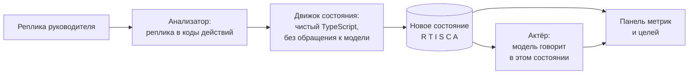

# Арена переговоров

Тренажёр сложных разговоров руководителя с сотрудником. Экран выглядит как окно видеозвонка: слева собеседник, справа панель состояния и целей разговора. Собеседник отыгрывается языковой моделью, но решает исход не она.

## Главное решение

Состояние персонажа считает детерминированный движок на TypeScript, файл `lib/engine/state.ts`. Языковая модель получает уже посчитанное состояние и только произносит реплику в нём.

Из этого следуют три свойства, которых нет у обычного чат-бота в роли:

1. Один и тот же набор действий руководителя даёт один и тот же результат. Это проверено юнит-тестами на детерминизм.
2. Персонажа нельзя продавить тем, что модель склонна соглашаться с собеседником. Сопротивление падает только от действий, которым матрица реакций назначила снижение.
3. Метрики на экране считает код, поэтому цифры в разборе отвечают за то, что действительно произошло в разговоре.

## Что уже работает

| Блок | Состояние |
| --- | --- |
| Сценарии | Записи в базе. Шесть готовых загружены сидами, новые создаются в админке. Полные матрицы реакций, слои скрытых интересов, заготовленные реплики на каждый уровень сопротивления |
| Движок состояния | Реализован и покрыт тестами, 53 теста в трёх файлах |
| Пользовательский контур | Полный путь от лендинга до разбора, включая обучение и подбор первого разговора по опросу |
| Голосовой ввод | Web Speech API, распознавание русской речи в браузере |
| Разбор разговора | Метрики до и после, таймлайн с точками перелома, слои интересов, переписанная реплика, проверка того, определил ли руководитель тип личности |
| Работа без ключей | Офлайн-режим на заготовленных репликах и эвристическом анализаторе, включён в `.env.example` по умолчанию |
| Контур администратора | Список сценариев, конструктор на восемь секций, генерация черновика, тест-прогон, аналитика. Подробности в разделе [Админка](admin/overview.md) |
| Настройки сценария из интерфейса | Сфера, тема, роли, характер, сложность, слои интересов и матрица реакций задаются администратором и меняют поведение собеседника. Подробности в [конфигурируемости](architecture/configuration.md) |

Незакрытые места перечислены в [границах MVP](product/scope.md) отдельным списком. Сверять документацию с прототипом проще, когда в ней нет расхождений в обе стороны.

## С чего начать чтение

- Запустить у себя: [Быстрый старт](run/quickstart.md).
- Развернуть публично: [Деплой на Vercel](run/deploy.md).
- Понять, на чём держится исход разговора: [Движок состояния](architecture/engine.md).
- Понять, откуда берётся ветвление: [Сценарии и ветвление](architecture/scenarios.md).
- Собрать свой сценарий: [Конструктор](admin/constructor.md).
- Посмотреть, какие ключи нужны и что работает без них: [Внешние сервисы и ключи](tech/services.md).

## Исходные документы

В репозитории рядом с кодом лежат материалы, по которым собран продукт. В опубликованную документацию они не входят.

- `docs/negotiation-simulator-spec.md`, полная продуктовая спецификация.
- `docs/psyco_specs.md`, психологическая методология: типы личности, матрицы реакций, слои интересов.
- `docs/full-flow-specs.md`, описание восьми экранов пользовательского пути.
- `JUDGE_MODULE.md`, экспериментальный режим оценки через LLM-судью.
