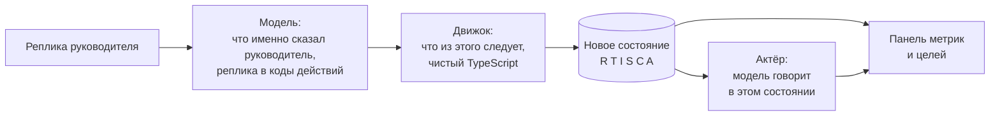

# Арена переговоров

Тренажёр сложных разговоров руководителя с сотрудником. Экран выглядит как окно видеозвонка: слева собеседник, справа панель состояния и целей разговора. Собеседник отыгрывается языковой моделью, но решает исход не она.

## Главное решение

Работа поделена между моделью и кодом, и граница проходит по смыслу задачи.

**Модель понимает, что именно сказал руководитель.** Живая речь не укладывается в кнопки: одну и ту же мысль человек выражает десятком способов, с оговорками, иронией и полунамёками. Это как раз то, с чем языковая модель справляется лучше любых ключевых слов. Она читает реплику и относит её к одному из 22 заранее заданных действий переговорщика - открытый вопрос, признание эмоции, опора на критерии, предложение вариантов, давление, обвинение, угроза увольнением.

**Движок решает, что из этого следует.** Дальше работает чистый TypeScript, файл `lib/engine/state.ts`. Он берёт распознанные действия, сверяется с матрицей реакций конкретного персонажа и пересчитывает шесть метрик. Тут же проверяются условия финала и раскрытие скрытых интересов. Обращений к модели в движке нет.

Почему так, а не «пусть нейросеть сама решит, как пошёл разговор»:

1. Реакция зависит от характера, а не от настроения модели. Твёрдая рамка снимает сопротивление у агрессивного и обрушивает доверие у тревожного, потому что так написано в матрице психолога. Модель не может смягчить персонажа просто потому, что она склонна соглашаться с собеседником.
2. Цифры в разборе отвечают за то, что произошло. Их считает код по правилам, которые можно прочитать, а не выдаёт нейросеть по ощущению.
3. Правила фиксится правкой данных. Если психолог считает, что действие оценено неверно, меняется число в матрице, а не промт.

Сам разговор при этом каждый раз новый: реплики персонажа модель формулирует живьём, и дважды одинаковых диалогов не бывает. Повторяется не текст, а логика: одни и те же распознанные действия дают одни и те же изменения метрик, и это закреплено юнит-тестами.

## Что уже работает

| Блок | Состояние |
| --- | --- |
| Сценарии | Записи в базе. Шесть готовых сценариев загружены сидами, новые создаются в админке. Полные матрицы реакций, слои скрытых интересов, заготовленные реплики на каждый уровень сопротивления |
| Движок состояния | Реализован и покрыт тестами, 55 тестов в трёх файлах |
| Пользовательский контур | Полный путь от лендинга до разбора, включая обучение и подбор первого разговора по опросу |
| Голосовой ввод | Web Speech API, распознавание русской речи прямо в браузере, без ключей. Chrome и Edge да, Safari частично, Firefox нет |
| Разбор разговора | Метрики до и после, таймлайн с точками перелома, слои интересов, переписанная реплика. Нераскрытые слои не показываются, чтобы не отдавать разгадку |
| Каталог разговоров | Колонка сфер, ленты по темам с прокруткой вбок, чипы сложности |
| Видео-аватары | Три лица на выбор администратора, немой цикл в окне звонка |
| Работа без ключей | Офлайн-режим на заготовленных репликах и эвристическом анализаторе, включён в `.env.example` по умолчанию |
| Контур администратора | Список сценариев, конструктор на восемь секций, генерация черновика, тест-прогон, аналитика. Подробности в разделе [Админка](admin/overview.md) |
| Настройки сценария из интерфейса | Сфера, тема, роли, характер, сложность, слои интересов и матрица реакций задаются администратором и меняют поведение собеседника. Подробности в [конфигурируемости](architecture/configuration.md) |

Незакрытые места перечислены в [границах MVP](product/scope.md) отдельным списком. Сверять документацию с прототипом проще, когда в ней нет расхождений в обе стороны.

## С чего начать чтение

- Запустить у себя: [Быстрый старт](run/quickstart.md).
- Развернуть публично: [Деплой на Vercel](run/deploy.md).
- Понять, на чём держится исход разговора: [Движок состояния](architecture/engine.md).
- Понять, откуда берётся ветвление: [Сценарии и ветвление](architecture/scenarios.md).
- Собрать свой сценарий: [Конструктор](admin/constructor.md).
- Посмотреть, какие ключи нужны и что работает без них: [Внешние сервисы и ключи](tech/services.md).

## Исходные документы

В репозитории рядом с кодом лежат материалы, по которым собран продукт. В опубликованную документацию они не входят.

- `docs/negotiation-simulator-spec.md`, полная продуктовая спецификация.
- `docs/psyco_specs.md`, психологическая методология: типы личности, матрицы реакций, слои интересов.
- `docs/full-flow-specs.md`, описание восьми экранов пользовательского пути.
- `JUDGE_MODULE.md`, экспериментальный режим оценки через LLM-судью.
