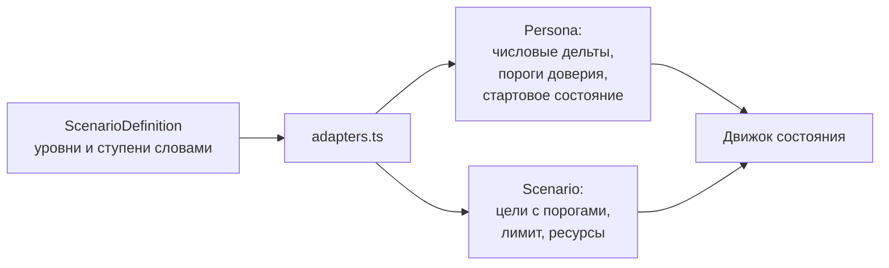

# Модель сценария

Сценарий это запись таблицы `ScenarioDefinition`. В ней ситуация и собеседник лежат вместе, потому что заполняются одной формой. Тип описан в `lib/scenarios/types.ts`, доступ к базе в `lib/scenarios/repository.ts`.

Файлы в `content/` остались исходным материалом для сидов. Во время игры приложение читает только базу.

## Поля

### Ситуация

| Поле | Тип | Назначение |
| --- | --- | --- |
| `title` | строка | Название в каталоге и в разборе |
| `domain` | строка | Сфера. Раздел в каталоге |
| `topic` | строка | Тема переговоров. Группа внутри раздела |
| `playerRole` | строка | Кем выступает игрок |
| `npcRole` | строка | Кем выступает собеседник |
| `context` | массив строк | Два или три пункта контекста |
| `initiator` | `npc` или `player` | Кто говорит первым |

### Собеседник

| Поле | Тип | Назначение |
| --- | --- | --- |
| `npcName` | строка | Имя |
| `npcPosition` | строка | Должность |
| `tone` | `aggressive`, `anxious`, `rational`, `custom` | Пресет характера |
| `characterNote` | строка | Одна строка для брифинга |
| `temperament` | строка | Манера речи, первая строка промта |
| `triggers` | массив строк | Что задевает |
| `soothers` | массив строк | Что располагает |
| `npcGoal` | строка | Чего он добивается |
| `openingLine` | строка | О чём первая реплика. Ориентир по смыслу, не готовая фраза |
| `exitLine` | строка | Как заканчивает разговор при срыве |

### Скрытые интересы

| Поле | Тип | Назначение |
| --- | --- | --- |
| `hiddenLayers` | массив объектов с полем `text` | От двух до пяти слоёв по порядку |
| `layerRevealCost` | число от 1 до 5 | Сколько конструктивных действий подряд раскрывают слой |

Пороги доверия не хранятся, они назначаются по порядковому номеру из ряда 40, 55, 70, 85, 92.

### Цели и ресурсы

| Поле | Тип | Назначение |
| --- | --- | --- |
| `playerGoals` | массив строк | Цели игрока на панели во время звонка |
| `successCriteria` | массив строк | Формулировка победы на брифинге |
| `resources` | массив строк | Что игрок может предложить |
| `constraints` | массив строк | Чего игрок не может |

Метрику и порог для каждой цели назначает система по рубрике: договорённости, сопротивление, пространство решений, ясность интересов.

### Сложность

| Поле | Тип | Назначение |
| --- | --- | --- |
| `difficultyPreset` | `easy`, `normal`, `hard` | Меняет три поля ниже разом |
| `startMetrics` | шесть уровней | `low`, `medium` или `high` на каждую метрику |
| `startMetricsExact` | числа, необязательно | Точные значения поверх уровней |
| `turnLimit` | число от 4 до 40 | Лимит реплик |
| `sensitivity` | число | Множитель дельт матрицы реакций |
| `showTypeInBrief` | булево | Показывать ли тип характера в брифинге |
| `trainingModeDefault` | булево | Включать ли учебный режим |

### Поведение и промт

| Поле | Тип | Назначение |
| --- | --- | --- |
| `reactions` | объект | Действие в метрики, значение это одна из семи ступеней |
| `fallbackLines` | объект, необязательно | Реплики офлайн-режима по уровням сопротивления |
| `customPrompt` | строка или пусто | Ручная правка промта. Пока не пусто, поля конструктора на промт не влияют |

### Служебные

| Поле | Назначение |
| --- | --- |
| `status` | `draft` или `published` |
| `playthroughCount` | Число настоящих прохождений, тест-прогоны не считаются |
| `createdAt`, `updatedAt` | Даты |

## Перевод в типы движка

Движок принимает те же типы, что и раньше, когда контент лежал в файлах. Приведением занимается `lib/scenarios/adapters.ts`, и это единственное место, где слова становятся числами.

| Что переводится | Как |
| --- | --- |
| Уровень метрики | `low` 15, `medium` 50, `high` 85. Точное значение перекрывает уровень |
| Ступень реакции | от −25 до +25 с шагом, затем умножение на чувствительность |
| Тон | В тип персонажа для подсказок подбора. Свой характер считается рациональным |
| Инициатор | `npc` в `employee`, `player` в `manager` |

## Как добавить сценарий

Обычный путь идёт через админку: [конструктор](../admin/constructor.md) или [генерация](../admin/generation.md).

Программно сценарий создаётся через `createScenario` из репозитория. Пример есть в `prisma/seed.ts`, он переносит авторский контент из `content/*.json` в эту же модель.
