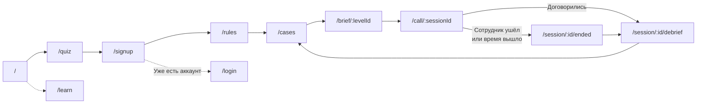

# Карта экранов и API

## Пользовательский путь



Порядок задан в `lib/flow/routes.ts`, там же лежит список маршрутов, требующих пройденного опроса.

| Адрес | Что на экране |
| --- | --- |
| `/` | Лендинг: что тренируем, с кем, что получаете |
| `/quiz` | Три вопроса: роль, актуальная тема, чем обычно заканчиваются такие разговоры |
| `/signup` | Экран регистрации. Бэкенда аккаунтов нет, рабочий путь это «Продолжить как гость» |
| `/login` | Экран входа, так же без бэкенда |
| `/rules` | Три карточки: как это работает, что вы качаете, как выиграть |
| `/cases` | Доска разговоров. На первом визите открыт один подобранный, после первого пройденного открываются все и появляется сводная карта метрик |
| `/brief/:levelId` | Брифинг: ситуация, ваша роль и полномочия, критерий успеха, что известно о собеседнике. Тип личности здесь не раскрывается |
| `/call/:sessionId` | Звонок. Собеседник, панель метрик и целей, ввод текстом или голосом |
| `/session/:id/ended` | Экран финала, когда сотрудник ушёл или кончилось время. Через несколько секунд сам ведёт в разбор |
| `/session/:id/debrief` | Разбор |
| `/learn` | Обучение на шесть шагов с практикой по таксономии действий |

Два адреса остались от предыдущей версии потока:

| Адрес | Состояние |
| --- | --- |
| `/debrief/:sessionId` | Редирект на `/session/:id/debrief`, чтобы старые ссылки не давали 404 |
| `/reflect/:sessionId` | Экран рефлексии прошлой версии. Ссылок на него нет, из интерфейса недостижим |

## API

### Основной движок

#### `POST /api/session`

Создаёт сессию.

```json
{ "levelId": "s1-rational" }
```

В ответе идентификатор сессии, сценарий, персонаж без матрицы реакций, стартовое состояние и первая реплика сотрудника, если инициатор разговора он.

Матрица реакций из ответа вырезана намеренно: иначе клиент получил бы таблицу правильных ответов.

#### `GET /api/session/:id`

Сессия с состоянием и историей ходов.

#### `POST /api/session/:id/turn`

Один ход. Отвечает потоком `text/event-stream`.

```json
{ "text": "Вижу, что тебе тяжело. Расскажи, что именно не получается?", "inputMode": "text" }
```

События по порядку:

| Событие | Содержимое |
| --- | --- |
| `analysis` | Распознанные коды действий, тон, обоснование, дельты метрик |
| `state` | Полное состояние, прогресс по целям, номер хода, остаток ходов, число раскрытых слоёв |
| `reveal` | Только если на этом ходу раскрылся слой интересов: номер слоя и текст |
| `npc_chunk` | Фрагмент реплики сотрудника, столько событий, сколько фрагментов |
| `npc_done` | Полный текст реплики, статус сессии, очки за ход и их расшифровка |

Ошибки: `400` на пустой текст, `404` если сессии нет, `409` если сессия уже завершена.

#### `POST /api/session/:id/replay`

Форк разговора с указанного хода.

```json
{ "branchTurn": 3 }
```

Создаёт новую сессию со ссылкой `parentId` на исходную, копирует ходы до указанного номера включительно и восстанавливает состояние на этот момент. При `branchTurn: 0` состояние создаётся с нуля. Из интерфейса сейчас не вызывается.

#### `POST /api/session/:id/commitments`

Принимает пункты договорённостей в формате «что, кто, к какому сроку, как проверяем» и возвращает реакцию персонажа: принял, просит переделать конкретный пункт, отказался. Модальное окно под это написано, но в экран звонка не подключено.

#### `GET` и `POST /api/session/:id/debrief`

Расчёт разбора предыдущей версии: звёзды за уровень, текстовые рекомендации по правилам из `lib/engine/recommendations.ts`, сохранение результата в таблицу `Debrief`. Текущий экран разбора этот путь не использует, он вызывает `loadDebrief` на сервере напрямую. Подробнее в разделе [Обратная связь по итогам](../architecture/feedback.md).

### Экспериментальный режим оценки

| Метод и адрес | Назначение |
| --- | --- |
| `POST /api/judge/session` | Создать сессию: сценарий и тип личности |
| `POST /api/judge/session/:id/turn` | Один ход через LLM-судью |
| `GET /api/judge/session/:id/report` | Итоговый отчёт |

Отдельные таблицы, отдельная логика, интерфейса нет. Примеры запросов в `JUDGE_MODULE.md` и в разделе [LLM-судья](../architecture/judge.md).

## Cookie и прослойка

`proxy.ts` на первом запросе ставит cookie `uid` со случайным UUID на год. Все сессии привязаны к ней. Матчер исключает статику Next.js и favicon.

В Next.js 16 файл прослойки называется `proxy.ts`, а не `middleware.ts`, и экспортирует функцию `proxy`. В выводе сборки она отображается как `Proxy (Middleware)`.
