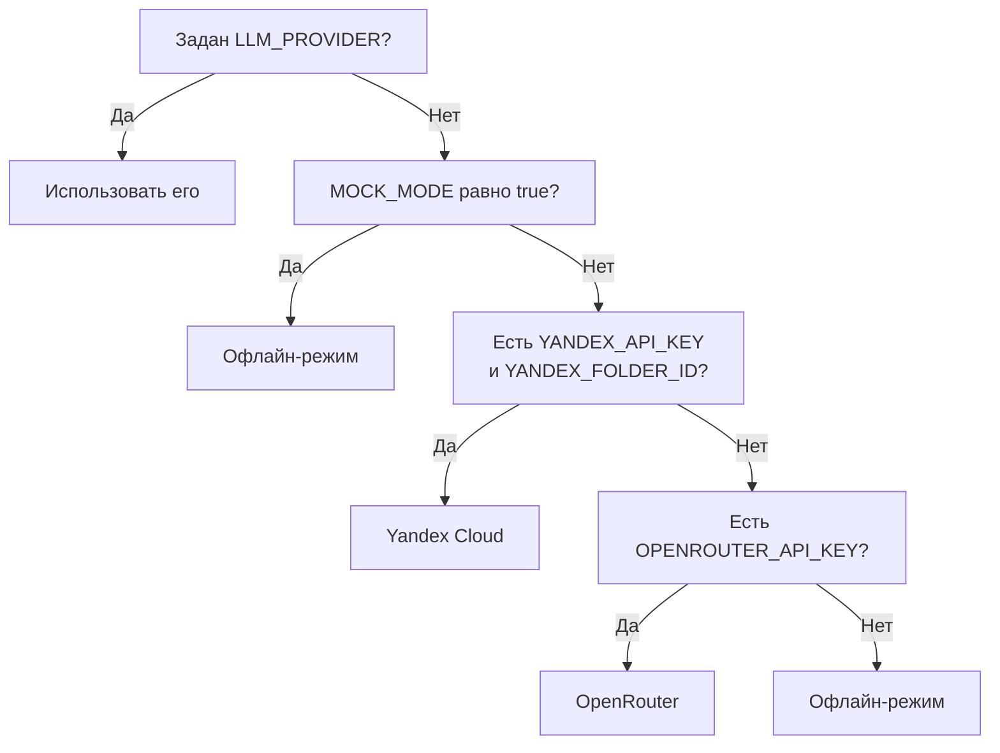

# Переменные окружения

Все переменные лежат в `.env`, образец с комментариями в `.env.example`. Для первого запуска ничего заполнять не нужно: скопированный образец уже работает.

!!! warning "Ключи не попадают в репозиторий"
    `.env` в `.gitignore`. Настоящие ключи вписываются только в локальный файл. В `.env.example` остаются пустые значения.

## База данных

| Переменная | Значение по умолчанию | Смысл |
| --- | --- | --- |
| `DATABASE_URL` | пусто | Строка подключения к PostgreSQL через пул. Используется в рантайме |
| `DATABASE_URL_UNPOOLED` | пусто | Прямое подключение к той же базе. Требуется миграциям: через пул Prisma не берёт advisory lock |

Обе переменные появляются сами после подключения базы из Marketplace, вписывать их руками не нужно. Подробно на странице [Деплой на Vercel](deploy.md).

## Выбор провайдера

| Переменная | По умолчанию | Смысл |
| --- | --- | --- |
| `LLM_PROVIDER` | пусто | Принудительный выбор: `yandex`, `openrouter`, `mock`. Пусто означает автоопределение |
| `MOCK_MODE` | `"true"` в образце | `true` включает офлайн-режим независимо от ключей. `false` требует настоящего провайдера |

Порядок разрешения в `resolveProviderName`, файл `lib/llm/provider.ts`:

Провайдер определяется один раз и кешируется на время жизни процесса. После правки `.env` сервер нужно перезапустить.

## Yandex Cloud Foundation Models

| Переменная | По умолчанию | Смысл |
| --- | --- | --- |
| `YANDEX_API_KEY` | пусто | API-ключ сервисного аккаунта |
| `YANDEX_FOLDER_ID` | пусто | Идентификатор каталога, вид `b1gxxxxxxxxxxxxxxxxx` |
| `YANDEX_API_MODE` | `native` | Какой эндпоинт использовать, разбор ниже |
| `YANDEX_MODEL` | `yandexgpt-lite` | Модель |
| `YANDEX_MODEL_VERSION` | `latest` | Версия модели |

### Два режима обращения

`native` обращается к классическому эндпоинту Foundation Models, `/foundationModels/v1/completion`. Работает для `yandexgpt` и `yandexgpt-lite`, поддерживает потоковую генерацию.

`responses` обращается к OpenAI-совместимому `/v1/responses`. Он обязателен для сторонних моделей каталога, таких как DeepSeek, Qwen и GPT-OSS: на нативном эндпоинте их нет.

Про потоковую генерацию у Yandex Cloud полезно знать две вещи. Streaming включается полем `stream` в теле запроса, а не отдельным адресом: маршрута `completionStream` не существует. И каждая строка потока приходит с полным текстом, сгенерированным к этому моменту, а не с приращением, поэтому провайдер сам вычитает уже отданное и наружу отдаёт нормальные приращения.

Для режима `responses` действует ещё одно правило. Часть этих моделей размышляет перед ответом и тратит на размышление бюджет выходных токенов. При маленьком бюджете модель возвращает пустой текст со статусом `incomplete`. Поэтому провайдер поднимает `max_output_tokens` минимум до 1200, сколько бы ни запросил вызывающий код.

### Про выбор модели и бюджет

`yandexgpt-lite` дешевле и быстрее остальных, а реплика персонажа занимает три-пять предложений, где разница в качестве рассуждений почти не видна. Для гранта в несколько тысяч рублей это разумный выбор по умолчанию. `yandexgpt` в версии Pro заметно дороже за вызов.

## OpenRouter

| Переменная | По умолчанию | Смысл |
| --- | --- | --- |
| `OPENROUTER_API_KEY` | пусто | Ключ |
| `OPENROUTER_MODEL` | `openai/gpt-4o-mini` | Модель |

## Роль модели в анализе реплик

| Переменная | По умолчанию | Смысл |
| --- | --- | --- |
| `ANALYZER_LLM` | `"false"` | `true` отдаёт классификацию реплик модели вместо эвристики |

Выключено намеренно. Эвристика на ключевых словах бесплатная, мгновенная и настроена под таксономию действий. Включение удваивает расход на ход и ничего не добавляет к воспроизводимости исхода, потому что решение всё равно принимает движок. Включать стоит, если нужно проверить, насколько точнее модель разбирает формулировки.

## Экспериментальный режим оценки

`JUDGE_LLM_CLIENT`, `JUDGE_STEP`, `JUDGE_MAX_DELTA_PER_TURN`, `JUDGE_TURN_LIMIT`, `JUDGE_COMMITMENT_SUCCESS`, `JUDGE_TRUST_FAIL`, `JUDGE_LLM_TIMEOUT_MS`. Значения по умолчанию и смысл в разделе [LLM-судья](../architecture/judge.md). Отдельных ключей не требуют.

## Объявлено, но не используется

| Переменная | Состояние |
| --- | --- |
| `ADMIN_PASSWORD` | Объявлена в `.env.example` под доступ к контуру администратора. Контура нет, кодом переменная не читается |
