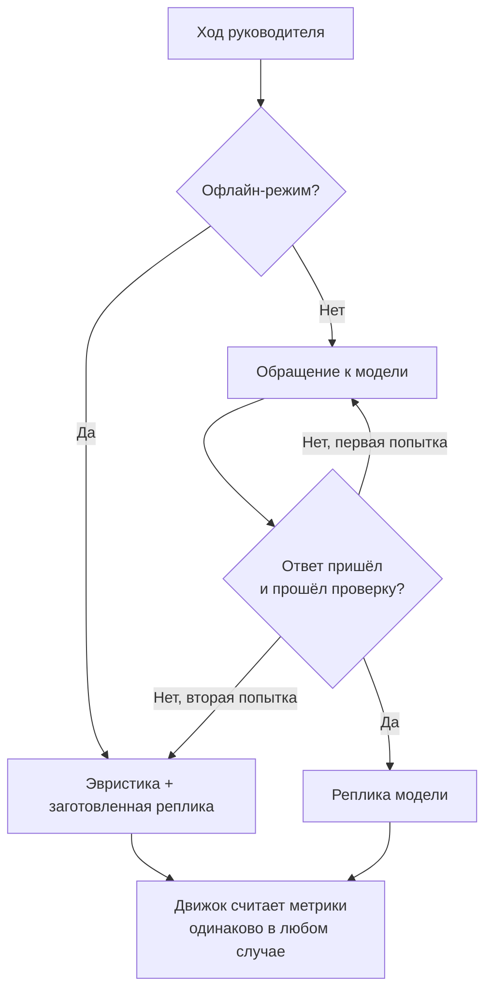

# Внешние сервисы и ключи

## Сколько внешних сервисов нужно

Один обязательный, база данных. Второй, провайдер языковой модели, нужен только для сгенерированных реплик: без него продукт остаётся играбельным на заготовленных.

| Сервис | Обязателен | Зачем |
| --- | --- | --- |
| PostgreSQL | да | Сессии, ходы и разборы. Единственный обязательный внешний сервис |
| Yandex Cloud Foundation Models | нет | Реплики собеседника, опционально разбор реплик руководителя |
| OpenRouter | нет | То же самое, альтернативный провайдер |
| Web Speech API | нет | Распознавание речи. Работает в браузере, ключей не требует |
| Офлайн-режим | по умолчанию | Реплики из заготовок персонажа, разбор реплик эвристикой |

Файловых хранилищ, сервисов аналитики и авторизации в проекте нет.

## Запасной режим

Это первое, что стоит проверить принимающей стороне, поэтому он описан до инструкций по ключам.

`.env.example` содержит `MOCK_MODE="true"`. Продукт в этом режиме:

- считает все шесть метрик тем же движком, что и с моделью;
- раскрывает слои скрытых интересов по тем же порогам доверия;
- определяет исход разговора теми же правилами;
- собирает разбор полностью, включая таймлайн, точки перелома и переписанную реплику;
- разбирает реплики руководителя эвристикой на ключевых словах;
- отвечает заготовленными репликами персонажа, по шесть на каждый из трёх уровней сопротивления.

Ни одного обращения к сети при этом не происходит. Проверить можно, отключив интернет: разговор пройдёт до конца.

Деградация работает и на втором уровне, когда ключи настроены, но провайдер недоступен. Актёр делает две попытки, проверяет результат пост-фильтром на длину и на выход из роли, и при неудаче берёт заготовленную реплику. Ход завершается, метрики считаются, разговор продолжается. Анализатор ведёт себя так же: невалидный ответ модели означает возврат к эвристике.



## Yandex Cloud, пошагово

### 1. Каталог

Зайти в `console.yandex.cloud`, выбрать облако и каталог. Идентификатор каталога виден на странице обзора каталога и выглядит как `b1gxxxxxxxxxxxxxxxxx`. Это значение для `YANDEX_FOLDER_ID`.

### 2. Сервисный аккаунт

В каталоге открыть «Сервисные аккаунты», создать аккаунт и выдать ему роль `ai.languageModels.user`. Этой роли достаточно для обращения к моделям.

### 3. API-ключ

У созданного сервисного аккаунта создать API-ключ. При создании спрашивают область действия ключа: нужна область для Foundation Models, то есть работа с языковыми моделями. Ключ показывается один раз, скопировать сразу. Это значение для `YANDEX_API_KEY`.

### 4. Прописать в `.env`

```
MOCK_MODE=false
LLM_PROVIDER=yandex
YANDEX_API_KEY=<ключ>
YANDEX_FOLDER_ID=<идентификатор каталога>
YANDEX_API_MODE=native
YANDEX_MODEL=yandexgpt-lite
```

Перезапустить сервер: провайдер определяется один раз за процесс и кешируется.

### 5. Проверить

```bash
curl -s -X POST http://localhost:3000/api/session \
  -H "Content-Type: application/json" -d '{"levelId":"s1-rational"}'
```

Затем сделать ход по адресу `/api/session/<id>/turn` и посмотреть, приходит ли текст в событиях `npc_chunk`. Если реплика совпадает с одной из заготовок из `content/personas/s1-rational.json`, значит сработала деградация, и причина видна в логах сервера: актёр печатает туда ошибку обращения к модели.

!!! danger "Ключи в чат и в репозиторий не попадают"
    `.env` в `.gitignore`. Настоящий ключ вписывается только в локальный файл. В `.env.example` остаются пустые значения.

## Какую модель выбрать

| Модель | Режим | Замечания |
| --- | --- | --- |
| `yandexgpt-lite` | `native` | Дешевле и быстрее остальных. Для реплики на три-пять предложений разницы в качестве почти не видно. Разумный выбор по умолчанию, если бюджет ограничен грантом |
| `yandexgpt` | `native` | Версия Pro, заметно дороже за вызов, рассуждает лучше |
| `deepseek-v4-flash`, `qwen3-235b-...`, `gpt-oss-20b` и другие модели каталога | `responses` | Только через OpenAI-совместимый эндпоинт. Размышляют перед ответом, поэтому отвечают медленнее и требуют повышенного бюджета выходных токенов |

Расход на разговор: от 4 до 14 ходов, по одному обращению к модели на ход. Если включить `ANALYZER_LLM=true`, обращений становится два на ход. Именно поэтому разбор реплик по умолчанию идёт эвристикой: он не влияет на воспроизводимость исхода, а расход удваивает.

## OpenRouter как альтернатива

```
MOCK_MODE=false
LLM_PROVIDER=openrouter
OPENROUTER_API_KEY=<ключ>
OPENROUTER_MODEL=openai/gpt-4o-mini
```

Формат запроса обычный, `chat/completions`, потоковая генерация поддерживается.

## Переход на другую базу данных

PostgreSQL подключается через Prisma и одну строку в `DATABASE_URL`, поэтому провайдер базы можно поменять, не трогая код приложения. Для развёрнутой версии база берётся из Vercel Marketplace, подробности на странице [Деплой на Vercel](../run/deploy.md).
